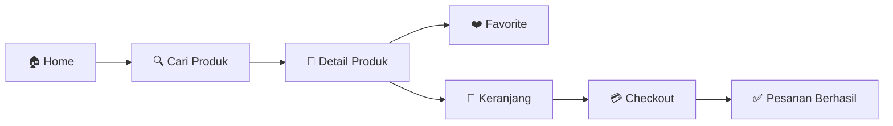
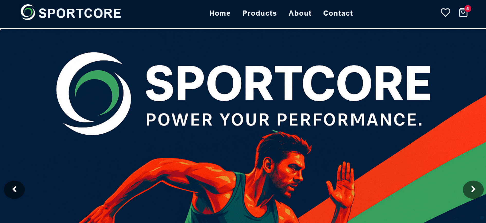
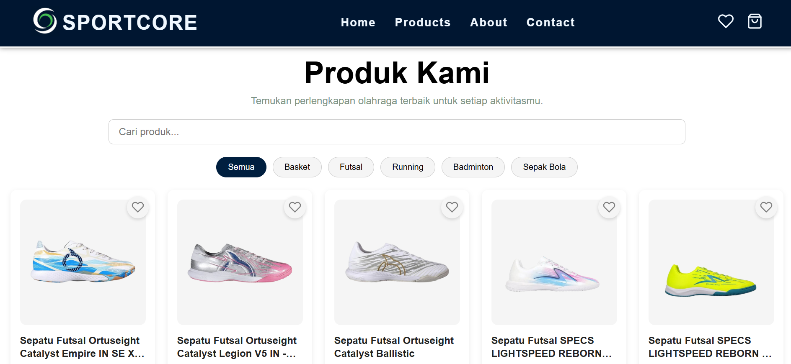
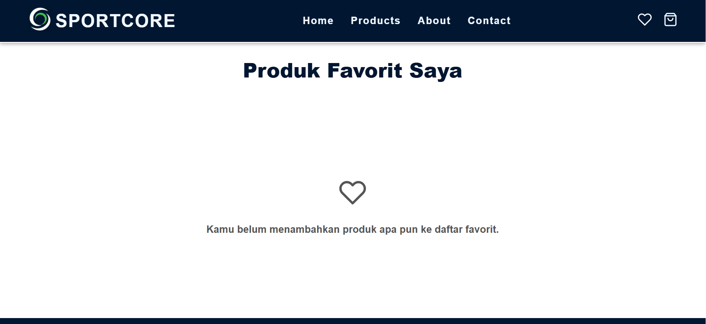
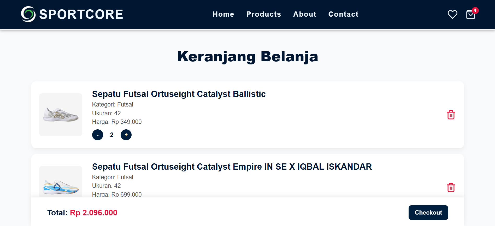
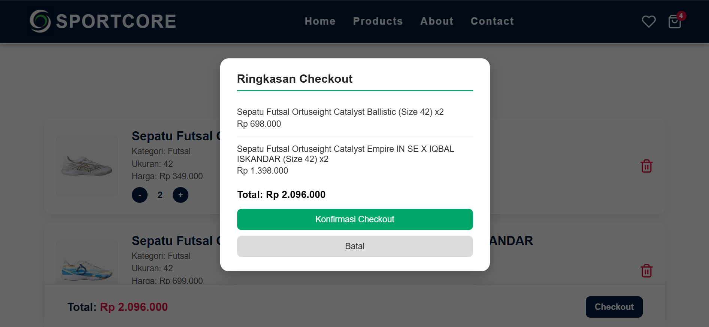

<div align="center">

# 👟 SPORTCORE

### *Modern Sports Shoes E-Commerce Website*

[](https://developer.mozilla.org/en-US/docs/Web/HTML)
[](https://developer.mozilla.org/en-US/docs/Web/CSS)
[](https://developer.mozilla.org/en-US/docs/Web/JavaScript)
[]()
[]()

Website e-commerce sederhana untuk menjual berbagai jenis **sepatu olahraga** dengan tampilan modern, responsif, dan interaktif.

</div>

---

# 📖 Tentang Proyek

**SPORTCORE** merupakan website e-commerce yang dibangun menggunakan **HTML, CSS, dan JavaScript**.

Website ini memungkinkan pengguna untuk:

- 👟 Menjelajahi berbagai produk sepatu olahraga
- ❤️ Menyimpan produk favorit
- 🛒 Menambahkan produk ke keranjang
- 💳 Melakukan proses checkout sederhana

Proyek ini dibuat sebagai media pembelajaran dalam mengembangkan website e-commerce dengan menerapkan konsep **UI/UX**, **DOM Manipulation**, **Local Storage**, dan **Responsive Web Design**.

---

# ✨ Fitur Utama

- 🏃 Daftar produk sepatu olahraga
- 🔍 Pencarian produk
- 🎯 Filter berdasarkan kategori
- 📄 Halaman detail produk
- ❤️ Favorite Products
- 🛒 Shopping Cart
- 💳 Checkout Page
- 📱 Responsive Design

---

# 🏷️ Kategori Produk

SPORTCORE menyediakan berbagai kategori sepatu olahraga, di antaranya:

- 🏃 Running
- 🏀 Basketball
- ⚽ Futsal
- 💪 Training
- 🎾 Tennis
- 👟 Lifestyle

---

# 🛠️ Teknologi yang Digunakan

| Teknologi | Fungsi |
|-----------|--------|
| HTML5 | Struktur halaman website |
| CSS3 | Styling dan responsive layout |
| JavaScript (ES6) | Interaktivitas dan logika aplikasi |

---

# 📂 Struktur Folder

```text
SPORTCORE/
│
├── css/
├── js/
├── img/
├── pages/
├── index.html
└── README.md
```

---

# 🚀 Cara Menjalankan Proyek

### 1️⃣ Clone Repository

```bash
git clone https://github.com/username/nama-repository.git
```

---

### 2️⃣ Masuk ke Folder

```bash
cd nama-repository
```

---

### 3️⃣ Jalankan Website

Buka file

```text
index.html
```

langsung menggunakan browser,

atau gunakan **Live Server** pada Visual Studio Code agar pengalaman pengembangan menjadi lebih mudah.

---

# 🔄 Alur Penggunaan Website


```mermaid
flowchart LR

A[🏠 Home]
--> B[🔍 Cari Produk]

B --> C[📄 Detail Produk]

C --> D[❤️ Favorite]

C --> E[🛒 Keranjang]

E --> F[💳 Checkout]

F --> G[✅ Pesanan Berhasil]
```

---

# 📸 Tampilan Website

## 🏠 Halaman Home



---

## 👟 Halaman Produk



---

## ❤️ Halaman Favorite



---

## 🛒 Halaman Keranjang



---

## 💳 Halaman Checkout



---

# ⚙️ Fitur yang Diimplementasikan

| Fitur | Status |
|--------|:------:|
| Home Page | ✅ |
| Product Page | ✅ |
| Detail Product | ✅ |
| Search Product | ✅ |
| Filter Category | ✅ |
| Favorite | ✅ |
| Shopping Cart | ✅ |
| Checkout | ✅ |
| Responsive Layout | ✅ |

---

# 🎯 Tujuan Proyek

Proyek ini dibuat sebagai latihan dalam mengembangkan website e-commerce dengan menerapkan:

- Struktur kode yang rapi
- Responsive Web Design
- JavaScript DOM Manipulation
- Local Storage
- User Interface (UI)
- User Experience (UX)

---

# 🚀 Rencana Pengembangan

Beberapa fitur yang akan dikembangkan di masa mendatang:

- 🔐 Login & Register
- 👤 User Profile
- 🛍️ Admin Dashboard
- 🗄️ Integrasi Database (MySQL/Firebase)
- 💳 Online Payment
- 📦 Riwayat Pesanan
- ⭐ Product Review & Rating
- 🔔 Notifikasi
- 🌙 Dark Mode

---

# 👨‍💻 Developer

**Firman Nova Prayoga**

Mahasiswa Teknik Informatika

Universitas Negeri Surabaya (UNESA)

---

# 📜 Lisensi

Proyek ini dibuat untuk **keperluan pembelajaran** dan **pengembangan portofolio**.

---

<div align="center">

### ⭐ Jangan lupa berikan Star jika proyek ini bermanfaat!

Made with ❤️ by **Firman**

</div>
