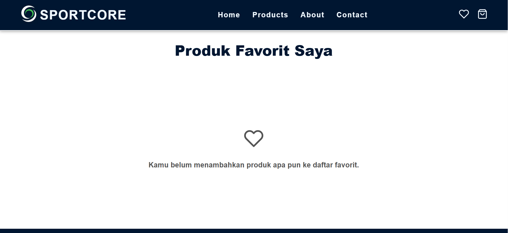

# SPORTCORE
Website e-commerce untuk jual beli sepatu olahraga.
Dibangun menggunakan HTML, CSS, dan JavaScript , website ini memungkinkan pengguna untuk menjelajahi berbagai jenis sepatu olahraga, menambahkan produk ke keranjang, dan melakukan pembelian secara online.

## Fitur Utama
- Daftar produk sepatu olahraga berbagai kategori (running, basket, futsal, training, dll)
- Halaman detail produk dengan deskripsi dan harga
- Fitur pencarian dan filter
- Keranjang belanja (shopping cart)
- Proses checkout sederhana

## Teknologi yang Digunakan
- HTML5 struktur halaman
- CSS3 styling dan layout responsif
- JavaScript interaktivitas dan logika aplikasi

## Cara Menjalankan Proyek
1. Clone repository ini ke komputer kamu:
git clone https://github.com/username/nama-repo.git
2. Masuk ke folder proyek:
cd nama-repo
3. Buka file index.html di browser
atau jalankan server lokal (contoh dengan VSCode Live Server).

## Tampilan Website
* Tampilan Halaman Utama

* Tampilan Halaman Product

* Tampilan Halaman Favorite

* Tampilan Halaman Keranjang

* Tampilan Checkout

## Tujuan Projek
Proyek ini dibuat sebagai latihan dalam membangun website e-commerce sederhana dengan:
- Struktur kode yang terorganisir
- Tampilan UI/UX menarik
- Fitur dasar jual beli online

## Rencana Pengembangan
- integrasi dengan database (MySQL / Firebase)
- Sistem login & register
- Halaman admin untuk manajemen produk
- Pembayaran online simulasi
